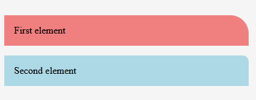
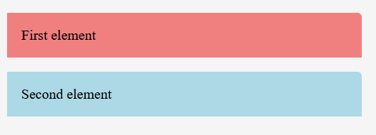

A lot of people coming from SASS probably don't understand fully the love or need for CSS variables, at the end of the day SASS has supported [variables](https://sass-lang.com/documentation/variables) since its beginning I guess. So how do they differ and do they at all?


## TLDR - Should I go full-on and only CSS variables or only SASS variables?

No... Yes... Maybe? At the moment I'm mixing both of these approaches: 

I'm still using a lot of values as normal SASS variables, for when I need a **static** piece - stuff like spacings, margins, breakpoints, etc. When I'm using SASS variables they're directly generated and don't ship to my browser. 

On the other hand, I use quite a bit of CSS variables - mainly for theming/colors, but also for responsive design - when I want to update a specific field in different viewports. I tend to find this approach a little bit cleaner, but again - this depends COMPLETELY on your taste, experience, and of course, on your specific case.  

In any case, adding CSS variables to your existing SASS variables is not a bad thing and you'll probably see a lot of advantages later on.


## Now the detailed example 

### Example setup

Let's have a really simple HTML page that contains 2 paragraphs:

```html
  <body>
    <p id="first" class="container">First element</p>
    <p id="second" class="container">Second element</p>
  </body>
```

which we want to have 2 different values for the `border-top-right-radius`.




This is can be done easily and "pretty" with CSS variables, like:

```css {1}
  .container {
    padding: 1rem;
    border-top-right-radius: var(--radius-size);
  }
  
  #first {
    --radius-size: 30px;
    background-color: lightcoral;
  }
  
  #second {
    --radius-size: 10px;
    background-color: lightblue;
  }
```

Now let's move this to a `.scss` file and try to keep the usage while we change to SASS variables. We need also to declare our variable or we'll get an error for an undefined variable in sass.

```scss
$corner-size: 5px;
.container {
  padding: 1rem;
  border-top-right-radius: $corner-size;
}

#first {
  $corner-size: 20px;
  background-color: lightcoral;
}

#second {
  $corner-size: 10px;
  background-color: lightgreen;
}
```

And now our elements look like:



Wait a second ... that's not what we want! But this doesn't make any change to the `border-top-right-radius`, it's easy to see that the value is still set to `5px`, although we changed the `$corner-size` for each element... Let's see the generated CSS code from SASS:

```css
.container {
  padding: 1rem;
  border-top-right-radius: 5px;
}

#first {
  background-color: lightcoral;
}

#second {
  background-color: lightgreen;
}
```

The key thing here is that the compiler has generated the `.container ` class, but the next selectors don't actually **use** the `$corner-size` so it's never recognized. If we want this to work as we expect we need something like :

```scss
$corner-size: 5px;
.container {
  padding: 1rem;
  border-top-right-radius: $corner-size;
}

#first {
  $corner-size: 20px;
  border-top-right-radius: $corner-size;
  background-color: lightcoral;
}

#second {
  $corner-size: 10px;
  border-top-right-radius: $corner-size;
  background-color: lightgreen;
}
```

which now bundles to

```css
.container {
  padding: 1rem;
  border-top-right-radius: 5px;
}

#first {
  border-top-right-radius: 20px;
  background-color: lightcoral;
}

#second {
  border-top-right-radius: 10px;
  background-color: lightgreen;
}
```

But this has so much duplicated code and it's not as clean as the CSS variable example... And here we come to a couple of the most important comments on SASS vs CSS variables:

### Scope of the variables
SASS variables have lexical scope:

> Variables declared at the top level of a stylesheet are global. This means that they can be accessed anywhere in their module after they’ve been declared. But that’s not true for all variables. Those declared in blocks (curly braces in SCSS or indented code in Sass) are usually local, and can only be accessed within the block they were declared. [SASS Variables](https://sass-lang.com/documentation/variables#scope)

while CSS variables have dynamic scope - they're defined and scoped to the element and can be used anywhere inside that element, while still being changed.

Keeping this in mind would mean, that to overwrite the globally scoped variable `$corner-size` we need to do something like:

```scss
$corner-size: 5px;
.container {
  padding: 1rem;
  border-top-right-radius: $corner-size;
}

$corner-size: 20px;
#first {
  border-top-right-radius: $corner-size;
  background-color: lightcoral;
}

$corner-size: 10px;
#second {
  border-top-right-radius: $corner-size;
  background-color: lightgreen;
}
```
I'm pretty sure you're starting to see the convenience of using CSS variables even in your SASS files.

### When do we access the variables
In our SASS example, we saw that we **can** overwrite our variable, but it should be used again. This is because SASS is being built to CSS -> the compiler goes and changes all the occurrences of `$corner-size` to the value we defined, in our case `5px`. Although we, later on, overwrite the value `$corner-size: 10px;` the value is never being used (more like "called") in that specific scope. That's why we need to duplicate the "usage", e.g. `border-top-right-radius: $corner-size;` so the compiler changes the variable here so it can be taken into account.


## Ending words

Those are actually at the start of this page - [Should I go full-on and only CSS variables or only SASS variables?](#tldr---should-i-go-full-on-and-only-css-variables-or-only-sass-variables). Hope you liked this one. Part 2 coming somewhere in the future.